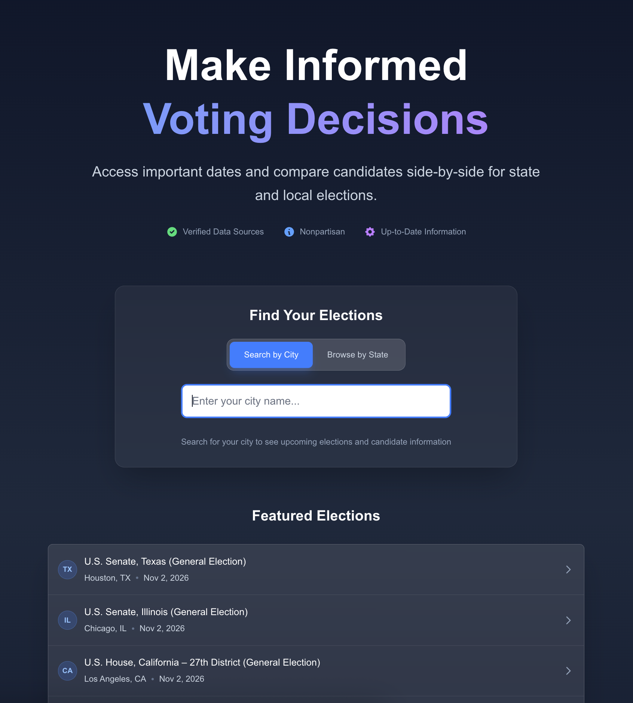
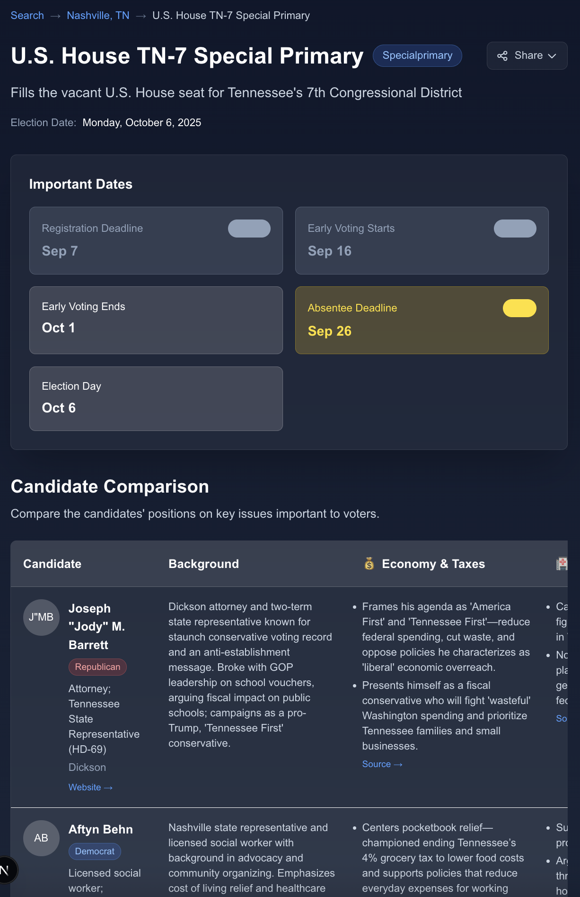

# Voter Guide

Nonpartisian voter guide that helps people find their local elections and compare candidates side-by-side.

## Features

- **Find your elections**: Search by city or browse by state to discover upcoming elections in your area
- **Compare candidates**: See all candidates for an election in one table with their positions on key issues
- **Key voting dates**: Registration deadlines, early voting periods, and election day info
- **Candidate details**: Background, positions, endorsements, and links to official websites

## Tech Stack

Built with Next.js, Tailwind CSS, and PostgreSQL.
